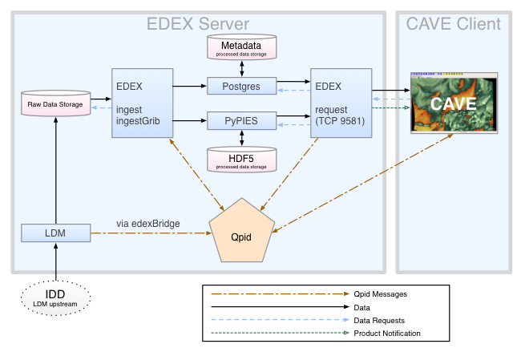

%I/O analysis of climate applications 
% Arne Beer, MN 6489196, Frank Röder, MN 6526113

\pagebreak

#Introduction
## About the paper and our goals

In this paper we analyze and present the strengths and weaknesses of different data structures required by some carefully picked climate and weather prediction models.
Further we investigate the bare minimum of data required by those models. 
Another important aspect we will elaborate is the pre- and post-processing of data and the precise moment it occurs.

In the following sections we will elucidate some models and the process on how to set them up as well as running sample cases. At the end there will be a section about the overall life cycle of data.

## Getting started

With intent of getting an overview about the richness of climate applications and their land, ice, weather and ocean modulation, we took an in-depth look at some models. The main goal was to find a model with proper documentation and a license which allowed us to use it for our research and benchmarking purposes.
Most model investigated by us were too old for our objective. In many cases there were practically no documentation, let alone active support or new releases.
The next obvious step was to get an good overview of up to date and easy to handle models which are still supported. For this purpose we put a spreadsheet together from which we could choose the most promising ones.
We came across some good looking models, but despite a good first impression, most of them are shipped with broken scripts, bad documentation or a hidden provision, which forbids us to use them.
After a long trial and error period of testing new models, we finally decided to stick to two models, which will be addressed later in this paper.

\pagebreak

# IFS - Integrated Forecasting System

## About IFS
_IFS_ has been chosen to be the first model for our research.
_IFS_ is a Model created and used by the European Center for Medium-range Weather Forecast (ECMWF). The purpose of this model is to create weather predictions by analyzing a huge amount of data. This data can be a variety of different physical bulks. \cite{ifs}

__ECMWF__ offers a semi open-source version of their model for research institutions, which is called _OpenIFS_. The source code of this model can be obtained by requesting a license for the institution one is working for.
They provide a good documentation about their model, which covers instruction for building, running simulations as well as very detailed information about the mathematics and techniques used in their model.
After some research and two weeks passing by, we discovered a passage in their license, which forbids "Commercial and benchmarking use of _OpenIFS_ models". As our original research goal is some kind of benchmarking we were forced to stop and switch to another model.
We still recommend to use this model in a research or academic context, as there is plenty of documentation and a big user base.

\pagebreak

# Further progress
After the license incident with IFS we had to look for other open source models we could use for our research. We looked at many models in the following we will list some of the most promising:

* WRF(The Weather Research & Forcasting Model)
* CFS(Climate Forecast System)
* GDAS (Global Data Assimilation System)
* GFS (Global Forecast System)
* GEFS(Global Ensemble Forecast System)
* CM2.X (CM2 Global Coupled Climate Models)
* GISS GCM ModelE
* _CESM_(Community Earth System Model)
* MITgcm (M.I.T. General Circulation Model News and Information)
* GEOSCI (Geoscientific Model Development)
* Hector v1.0
* MAGICC/SCENGEN (Model for the Assessment of Greenhouse-gas Inducted Climate Change A Regional Climate SCENario GENerator)
* Metview
* COSMO(Consortium For Small Scale Modeling)
* SAGA (System for Automated Geoscientific Analyses)
* MPI-ESM
* ECOHAM

The lookup for new models took about two weeks. Most of the models mentioned above had serious flaws which forbid us to use them in our research.
Many of them have stopped being maintained many years ago.
In some cases there was no license provided with no available support for clarifying legal questions. In other cases it was only possible to obtain a license for our specific research goal by buying it or it was even completely forbidden to use it for benchmarking purposes, as with _OpenIFS_.

Eventually we decided to focus our work on _Community Earth System Model_ (_CESM_) and Ecosystem model Hamburg Version 5 (ECOHAM5). Further we decided to take a look at _AWIPS2_ a tool for displaying processed weather forecast with a very good server for handling data called _EDEX_ .

\pagebreak

# Unidata - AWIPS2

_AWIPS2_ contains tools for weather forecast displaying and analysis. This open-source `Java` application consists of _EDEX_ a data server and _CAVE_ the client for data analysis and rendering. \cite{Uni01}
Cite : "AWIPS II is a Java application consisting of a data display client _CAVE_ which runs on Red Hat/CentOS Linux and OS X and a backend data server EDEX which only runs on Linux" \cite{Awips}

## EDEX (Environmental Data EXchange )
**EDEX** is the server for _AWIPS2_ which is mainly used for preparing the data needed by _CAVE_. The _EDEX_ server is a compound of different components: \cite{AwipsDocs}

The first source for data is the Local Data Manager (_LDM_). This is a piece of software which shares data with computers in other networks. The Internet Data Distribution (_IDD_) provides the _LDM_ with data from the Unidata community.
The _LDM_ can handle different kinds of data, for instance National Weather Service data streams, radar data, satellite images or grid data from numerical forecast models. The data can be directly obtained from the source or by a _LDM_ that communicates with another _LDM_.
When the _LDM_ receives data inside the _EDEX_, a message about availability of new data is being send to the **Qipd** process, the Apache __Queue Processor Interface Daemon__, which distributes it to all other components of the _EDEX_ server.
The messages from **Qipd** will also contain a file header for _EDEX_ to know which decoder should be used for the specific data.

After that _EDEX_ can decode the data to make it ready for additional processing or signal _CAVE_ that it is available for displaying. All of those messages are sent via the **edexBridge**. 
The default ingest server will handle all the data which are different to grib messages and is in general just responsible for the ingest of data. GRIB fully spelled __General Regularly-distributed Information in Binary form__ is a
data format by the ___WMO___ (World Meteorological Organization) and used for encoding results of weather models. The data is written in a binary shape into a table format. It is optimized for store and transfer data.
The PostgreSQL database or __Postgres__ in short is another relevant part for the storage of data in _EDEX_. It handles the metadata of the already decoded data. Postgres itself is a relational database management system which reads and store all _EDEX_ metadata. The database size is not limited and can handle 32 TB of database table capacity.

_HDF5_ fully spelled Hierarchical Data Format (v.5) is the main format used in _AWIPS2_ to store processed grids, images,  etc. . Nowadays it is very similar to netCDF, which is
supported by Unidata. HDF5 can handle many different types of data in a single file, for instance data of multiple radars.

The __Python Process Isolated Enhanced Storage__ PyPIES has been just created for _AWIPS2_ and is used for the writes and reads of data in HDF5 files. __PyPIES__ is very similar in functionality compared to __Postgres__. It is a custom database abstraction layer, which processes any requests related to the HDF5 file system. The intention for this layer was to isolate the EDEX from the HDF5 processes.

## CAVE (Common AWIPS Visualization Environment)
_CAVE_ is the second part of _AWIPS2_. It is a tool for data visualization and rendering. Normally it is installed on a separated workstation apart from the other _AWIPS2_ parts.  
Cite: "CAVE contains of a number of different data display configurations called perspectives. Perspectives used in operational forecasting environments include D2D (Display Two-Dimensional), GFE (Graphical Forecast Editor), and NCP (National Centers Perspective). \cite{AwipsDocs}

## Installation
For the installation of _AWIPS2_ UniData provides a Github repository [https://github.com/Unidata/awips2](https://github.com/Unidata/awips2) and two install scripts `installCave.sh` and `installEDEX.sh`.
Those install scripts use yum as a package manager and are designed for usage on CentOS, Fedora and Red Hat.
To make it compatible for the _DKRZ_ cluster there is more that needs to be done. As stated before _AWIPS2_ is normally installed with the help of the package manager YUM and _AWIPS2_ requires a directory at root location "/awips2/". There are about 2000 lines of code where "/awips2/" is hard-coded, so switching directories is not an option.

**To build** a version for our purpose it would be the best to have an _EDEX_ on the cluster which is providing our local _CAVE_ with data for visualization.
Because of time constraints we were forced to move our focus away from _AWIPS2_ and get back to climate models. 

\pagebreak

# CESM - Community Earth System Model

## About _CESM_
_CESM_ itself consists of six geophysical models: ocean, land, land ice, sea ice, river and atmosphere . The _CESM_ project is founded and supported by U.S. climate researchers and for the biggest part by the National Science Foundation (NSF).
If there are different models in use, a so called coupler handles the time progression and overall management between the coupled models through sequences of communication.
The scientific development is conducted by the _CESM_ working group twice a year. For more information related to the development its recommended to visit the website [__**http://www.cesm.ucar.edu**__](http://www.cesm.ucar.edu).
Additionally the _CESM_ developers claim that it can be run out-of-the-box. "Bit-for-bit reproducibility" cannot be guaranteed, because of using different compilers and system versions.

The following _CESM_ sections are referring to the userguide \cite{CESMDocs}.

## Requirements
In the following we list some preconditions directly from the _CESM_ documentation.

* UNIX style operating system such as CNL, AIX and Linux        \checkmark
* csh, sh, and perl scripting languages                \checkmark
* subversion client version 1.4.2 or greater        \checkmark
* Fortran (2003 recommended, 90 required) and C compilers. pgi, intel, and xlf are recommended compilers.        \checkmark (gfortran gcc-Version 4.8 on the cluster)
* MPI (although _CESM_ does not absolutely require it for running on one processor)        \checkmark
* NetCDF 4.2.0 or newer.        \checkmark (Version 7.3 & 4.2)
* ESMF 5.2.0 or newer (optional).
* pnetcdf 1.2.0 is required and 1.3.1 is recommended (optional) 
* Trilinos may be required for certain configurations        X
* LAPACKm or a vendor supplied equivalent may also be required for some configurations.                \checkmark (Version 3.0)
* CMake 2.8.6 or newer is required for configurations that include CISM.        \checkmark (Version 2.8.12.2 on the cluster)

## Installation
- Open source
- Download at [__**CCMS(Click here)**__](http://www.cesm.ucar.edu/models/cesm1.2/cesm/doc/usersguide/x290.html#download_ccsm_code):
    - Username: guestuser
    - Password: friendly
- Version 1.2.1
- Available with svn: 

       	  svn co 
	  https://svn-ccsm-models.cgd.ucar.edu/cesm1/release_tags/cesm1_2_1 \
          cesm1_2_1 --username guestuser --password friendly

- We recommend to create an entry in your `~/.subversion/servers` config for later svn usage with scripts:

        [groups]
        cesm = svn-ccsm-inputdata.cgd.ucar.edu

        [cesm]
        username = guestuser
        store-passwords = yes

Most parts of the _CESM_ software project are open source. However three libraries are published by the Los Almos National Laboratory, who licensed their 
software as free to use as long as it isn't used in a commercial context. Affected libraries are POP, SCRI and CICE [(__***For link to license click here***__)](http://www.cesm.ucar.edu/management/UofCAcopyright.ccsm3.html).

## Input Data Set
### Setup
There is actually a set of input data which can be downloaded and configured for _CESM_. It can be made available through another subversion input data repository using the same user name as used in the installation above.  
The dataset is around 1 TB big and should not be downloaded entirely. The download is regulated on demand, which means if _CESM_ needs the particular data it will be downloaded and checked automatically by _CESM_ itself. The data should be on a device with a fast connection to the actual computing device.  
The data will be downloaded into the `$DIN_LOC_ROOT` folder, which has to be set in the `env_run.xml` in the "Build Setup" step later on. Multiple users can use the same `$DIN_LOC_ROOT` directory and it should thereby be configured as group writable.  
The input data can be downloaded manually as well as using the `check_input_data` script. The script triggers a partial download of the svn input data repository and allows to exactly specify the data that should be downloaded. This script is called during the `setup_case` step as well. If the specified data is not found in `$DIN_LOC_ROOT` it will automatically be downloaded by the script.  
If one likes to download the input manually it should be done __before__ building _CESM_. In addition it is also possible to download the data via svn subcommands direct, but it is much better to use the `check_input_data` script as it secures to download only the required data.  
If the machine is supported by _CESM_, there should be a preset in `ccsm_utils/Machines`. Otherwise there is the possibility to make it run on generic machines with the variable `-mach userdefined` as argument for the `./scripts/create_newcase` script and further configuration afterwards.

## CESM Creating And Configure A New Case

### Prerequisites

`perl-switch` and `csh` is needed for the further project setup.

### Create a new case
Cases are created with a resolution and configurations fitting to the machine it should be executed at.
To create a case execute `./scripts/create_newcase` with the respective parameters.
This is a command for a user defined machine with the `B1850CN` input data set:

        # Parameters are respectively:
        # Case name and directory location
        # Machine name
        # Component set name
        # Resolution
        /create_newcase -case ./test1 \
            -mach userdefined \
            -compset B1850CN  \
            -res f45_g37

In the original repository many errors occur due to deprecated syntax and buggy setup code. We recommend to use our updated version of the code.
The text `Successfully created the case` should appear on your screen.
If problems with `create_newcase` occur, one should try one of the examples listed in the error message.

In case `create_newcase` breaks while calling one of the `mkbatch.*` scripts, you probably need to install CShell, as those scripts are written for `#!/bin/csh`.

The result of `create_newcase` is a directory `.../cesm/scripts/<YourCase>` with a bunch of directories or filenames to be explained:

	README.case	- This files will contain tracked problems
			and changes at runtime
	CaseStatus	- A File containing a history of operations
			 done in the actual case
	BuildConf/	- The files in this directory are scripts
			for generating component 
			name lists and utility libraries. They should
			 never be edited.
	SourceMods/	- This directory is for modified source code
	LockedFiles/	- It contains copies of files that should not
			 be changed, xml are locked until the clean 
			operation is executed
	Tools/		- A directory which contains support scripts.
			 They should never be edited.
	env_mach_specific	- machine-specific variables for 
				building/running are set here
	env_case.xml	- Case specific variables like the root 
			and models are set(cannot be changed, have
			to re-run create_newcase for changes)
	env_build.xml	- Contains the build settings, resolution and
			 configuration options
	env_mach_pers.xml	- Sets the machine processor layout
	env_run.xml	- Contains run-time settings
	cesm_setup	- Script for set up
	$CASE.$MACH.build	- Script for building components,
		 executables and utility libraries
	$CASE.$MACH.clean_build	- Remove all object files 
					and libraries
	$CASE.$MACH.l_archive	- Script for long-term archiving of
		output (only if it is available on the machine)
	xmlchange	- Utility to change values in other .xml files
	preview_namelists	- Utility to see the component name lists
	check_input_data	- Check for input datasets
	check_production_test	- Creates a test of the owners case

### Setup case

Once a case has been created by the previous command, the setup has to be completed.
To achieve this, the `cesm_setup` script in the case directory needs to be executed.
Settings for this specific case are specified in `env_mach_pes.xml`. The documentation states that this file should only be manipulated by using the `xmlchange` script.
As we want to use our own machine, we need to create a user defined machine for this test case.

Values that need to be set:

- `MAX_TASKS_PER_NODE` in `env_mach_pes.xml`
- `OS` in `env_build.xml`
- `MPILIB` in `env_build.xml`
- `COMPILER` in `env_build.xml`
- `EXEROOT` in `env_build.xml`
- `RUNDIR` in `env_run.xml`
- `DIN_LOC_ROOT` in `env_run.xml`

There is an example configuration in `scripts/example_config`. This configuration expects a folder in root `/cesm` and `/cesm/inputdata`, but if you don't have root access at your location, those variables can be easily changed (`EXEROOT`, `RUNDIR`, `DIN_LOC_ROOT`).

### Build case

To build a case, the `$CASENAME.build` script needs to be executed.
In case you chose the `gnu` compiler in your settings, make sure you have `gmake` installed and create a symlink from `gmake` to `make`.
If any previous builds failed, `$CASENAME.clean_build` needs to be executed.

### Getting data
If you don't want to download input data manually, jump to the `Quickstart` chapter.
The data download script lies directly in `cesm1_2_1/scripts/"yourcase"` you created one step back.
To download input data to a specific data directory execute this with an adjusted path.
        
         export DIN_LOC_ROOT='/Path/to/input/data/dir'
         mkdir -p $DIN_LOC_ROOT
        ./check_input_data -inputdata $DIN_LOC_ROOT 
		-export -datalistdir $DIN_LOC_ROOT  

Now it also should be possible to check if the required data is present with follow command:

	check_input_data -inputdata $DIN_LOC_ROOT -check

To download missing data from the server use:

	check_input_data -inputdata $DIN_LOC_ROOT -export

Booth commands need to be run inside the `$CASEROOT`

### Build the Case

	  cd ~/cesm/EXAMPLE_CASE
	  ./cesm_setup
	  ./EXAMPLE_CASE.build

\newpage
## Quickstart
This QuickStart \cite{CESMDocs} should give an brief overview about the work flow of _CESM_ , especially if there already is a version ported to the local target machine. If that is not the case, start with the more detailed description above.

There are a couple of definitions which have to be kept in mind:

        $COMPSET refers to the components set
        $RES refers to the model resolution
        $MACH refers to the target machine
        $CCSMROOT refers to the _CESM_ root directory
        $CASE refers to the case name
        $CASEROOT refers to the full pathname of the root directory 
		      where the case ($CASE) will be created
        $EXEROOT refers to the executable directory 
		      ($EXEROOT is normally __not__ the same as $CASEROOT)
        $RUNDIR refers to the directory where _CESM_ actually runs. 
		This is normally set to $EXEROOT/run. 
		(changing $EXEROOT does not change $RUNDIR 
		as these are independent variables)

In the first step you need to [__***download(Click here)***__](http://www.cesm.ucar.edu/models/cesm1.2/cesm/doc/usersguide/x290.html) _CESM_ and select a machine, a component set and a resolution from the list displayed after using this commands:
        
        > cd $CCSMROOT/scripts
        > create_newcase -list

There is a list of _CESM_ supported components like [__***sets(Click here)***__](http://www.cesm.ucar.edu/models/cesm1.2/cesm/doc/modelnl/compsets.html), [__***resolution(Click here)***__](http://www.cesm.ucar.edu/models/cesm1.2/cesm/doc/modelnl/grid.html) and [__***machines(Click here)***__](http://www.cesm.ucar.edu/models/cesm1.2/cesm/doc/modelnl/machines.html).
Remember, that the `-list` will always provide a list of supported component sets for the local _CESM_ version.
The first letters of the `-compset` option will indicate which kind of model is used.
To create a case the command `create_newcase` is used. It creates a case directory containing the scripts and XML files to set up the configurations for resolution, component set and machine requested. The `create_newcase` has some arguments as condition and some additional options for generic machines. For more information `create_newcase -h` should help.
In case that a supported machine is in use `($MACH)` type the following words:

        >create_newcase -case $CASEROOT \
                -mach $MACH \
                -compset $COMPSET \
                -res $RES

When using the machine setting `userdefined` it is required to edit the resulting `xml` files and fill them with the informations needed for the target machine.
The `create_newcase -list` command will also show all available machines for the local version.
For running a new target machine use the __section above__.

To setup the `case run script` be sure to use the `cesm_setup` command which creates a $CASEROOT/$CASE.run script with `user_nl_xxx` files, while the xxx tell us something about the case configuration. But before running `cesm_setup` there is the `env_mach_pes.xml` file in $CASEROOT to be modified for the experiment.
        
        > cd $CASEROOT

After this the `env_mach_pes.xml` can be modified with the ___xmlchange___ command. Take a look at `xmlchange -h` for detailed information. Then the `cesm_setup` can be initiated.

        > ./cesm_setup

With the optional build modifications in mind (`env_mach_pes.xml`) the build script can be startet:

        > $CASE.build

To run the case and maybe setting the variable $DOUT_S in `env_mach_pes.xml` to `false` the job can be submitted to the batch queue:

        > $CASE.submit

After the job finished you can review all the following directories and files like:

        1. $RUNDIR
          * the directory set in the `env_build.xml` file
          * the location where the _CESM_ was run with log files for
	  	every part
        2. $CASEROOT/logs
          * if the run was successful the log files have been copied
	  	into this directory
        3. $CASEROOT
          * here should a standard out or error file
        4. CASEROOT/CaseDocs
          * a list a case names is copied to this directory
        5. CASEROOT/timing
          * here are timing files which are representing the
	  performance of the model
        6. $DOUTS_S_ROOT/$CASE
          * This directory is an archive depending on the setting
	  done above, while it is true there is a log and history

## Conclusion

We managed to fix the build scripts to create and setup a case. In the step of compiling the code we encountered a few errors, but we were able to compile two models. After that another error occurred during compilation of the `pio` module.
_CESM_ ships with a parallel IO library, which practically is a set of interfaces for netcdf, parallel netcdf or binary IO. We chose to use pnetcdf for our build.
After installing the required libraries and setting the proper paths and variables, as described in their documentation, the build still failed and required a configuration file for `pio`. There is no further information about this configuration file in their documentation.
After writing their support without response, we were forced to stop using _CESM_.

After all _CESM_ still looks like a promising model, but it has many flaws. Their build scripts aren't generic. Nearly 6 weeks were spent to understand the code and fix old syntax or hard-coded paths.
If there were better documentation about the setup and compilation for _CESM_ we could've probably used it, as we were really close to compiling it.

# ECOHAM5

## About
_ECOHAM5_ (ECOsystem Model Hamburg Version 5) is a physical-geological-biochemical model for different levels of ocean depth in which different elements
react with each other. This version takes advantage of parallelism through interprocess communication. The physic behind this model is based on the
hydrodynamic model called _HAMSOM_. In comparison to older _ECOHAM5_ versions this one has a better generic approach to cope with different grid resolutions.
The information in this section were taken from the "ECOHAM5 user guide" \cite{ecoham5}.

### Source Code
Not freely available in the internet.

### Compile ECOHAM5
To compile _ECOHAM5_ for a testcase, there is the following script to be run in different ways:

	./CompileJob-cluster.sh TEST 0  // for just the compiling

	./CompileJob-cluster.sh TEST 1	 
		// for compiling and make it ready to run

	./CompileJob-cluster.sh TEST 2	// compiling and run the model

In our case `TEST` is the data input. If an error occurs and you don't have the permission to run `sbatch` on a specified partitions, it is necessary to make modification in the `RunJob.TEST` located in the folder of the declared input. The `wrk` directory will contain most of the output generated by the case. 
The directory `/Input` inside the `/wrk` folder contain all the input used for the case. There are `.dat` `.header` and `.direct` files which are providing the application with all data needed.
To visualize the newly created case there is a folder named `/res.TEST` with a subdirectory 
`/TEST.1977.00` in which you can find the netCFD data file `TEST_3D.nc`.
For our purpose we used __ncview__ and __ncdump__ to analyze the generated output.

### Using ncview
Ncview is very easy to start once you know where the `.nc` file of your choice is. For help beyond our purpose in this paper, we recommend to have a look at their homepage [http://cirrus.ucsd.edu/...](http://cirrus.ucsd.edu/~pierce/software/ncview/index.html "ncview tutorials").

_Figure 2_ shows Europa and the wind speed colored by a scale. There are a bunch of settings
which can manipulate the view at the data.
An example of the resulting insight can be seen in _Figure 2_.

### Using ncdump

Ncdump has a different approach of reviewing data, by converting a netCDF data file in to a better readable text format for humans.
A result of ncdump can be seen in _Figure 3_.
\begin{eqnarray*}
\text{\phantom{'test'}}
\end{eqnarray*}

\begin{eqnarray*}
\text{\phantom{'test'}}
\end{eqnarray*}

\begin{eqnarray*}
\text{\phantom{'test'}}
\end{eqnarray*}

\break

\begin{figure}[h!]
    \centering
    \includegraphics{pics/ncdumpecoham.png}
    \caption{ECOHAM5 with ncdump}
\end{figure}

\begin{figure}[h!]
    \centering
    \includegraphics{pics/ncviewecoham.png}
    \caption{Visualization of ECOHAM5 output data in ncview visual browser}
\end{figure}

# Life cycle of data

## General
Through the whole process of running a simulation there are different types of data at certain points. The complexity and the information can differ.
The data which is fed into the program at the beginning won't be the same which is visualized by a color on the climate overview. \cite{lanuni}

The life cycle could be divided into the parts shown in _Figure 4_ \cite{lanuni2} and can differ from institution to institution:

1. creating data
2. processing data (pre- and post-processing included)
3. analyzing data
4. preserving data
5. giving access to data
6. re-using data

### Creating the data

Creating the data could also be referred to as the design of the research. The choices made during this step will be crucial, because it will have an huge impact on the processing as well as at the overall structure of the application.
Which kind of data management, formats or storage should be used are just some examples of questions which needs to be answered for a proper design.
If there are already similar existing simulations, their data could be re-used for the current step.
In case there is no similar simulation, new data needs to be collected by research and experiments. 
Running simulations and capturing metadata are important parts of this process.

### Processing data
This step will contain the digitization, transcribing and translation of data into a useful figure. 
It also is about the vetting of validate and clean data.
Anonymizing data could also be part of processing. Sometimes there is pre- and post-processing besides the general processing. Pre-processing will prepare the particular data
before a certain step. In this step all unneeded information will be dismissed to save time and storage capacity. After this there might be the post-processing.
This process includes the treatment of data to make it usable for following steps.
For example the data should be described and explained to make it easy to read for other people.
As a last step it is necessary to take a look at the storage of the data. 

### Analyzing of data

It is hard to get any valuable information out of pure data, especially if there are thousands of values and rows. Therefore we need methods to interpret them.
Derivation of data during calculation of the output of the research and making publications is another part. Now main calculations of the data are done, the data have to be prepared for preservation.

### Preserving of data

Preservation of data is about looking for the best formats and best media on which it should be backed up and stored. Also creation of meta data and documentation is important for the final archiving.

### Giving access to data

Because research is done mostly by public institutes there is the demand of sharing and distributing the data and knowledge. Considering a mechanism for access control and determine copyrights might also be very useful.

### Re-using data

Research in the future could also be based on the work which was done in the past. Teaching and publications may be good examples for re-using.

## Summary

With the growth of data in simulations and the constant rapid improvement of processing power, it is very essential for research establishments to maintain a proper storage technology.
The data and knowledge are the key and the only thing those institutes are working for.
Therefore data and knowledge needs the right treatment.

# Conclusion

This project was about the analysis of input and output of climate applications.
We made our way through running models provided by our supervisors and some we found in the internet which seemed suitable for our purpose.
We faced bad documentations and insufficient scripts for making such a model run.
At the end we didn't manage to run most of them at different levels of progress.
_ECOHAM5_ was the only one which worked on the fly
Apart of that it didn't kept us away from documenting our respective progress on the models as well as analyzing the life cycle of data in general. 

# References

\printbibliography
